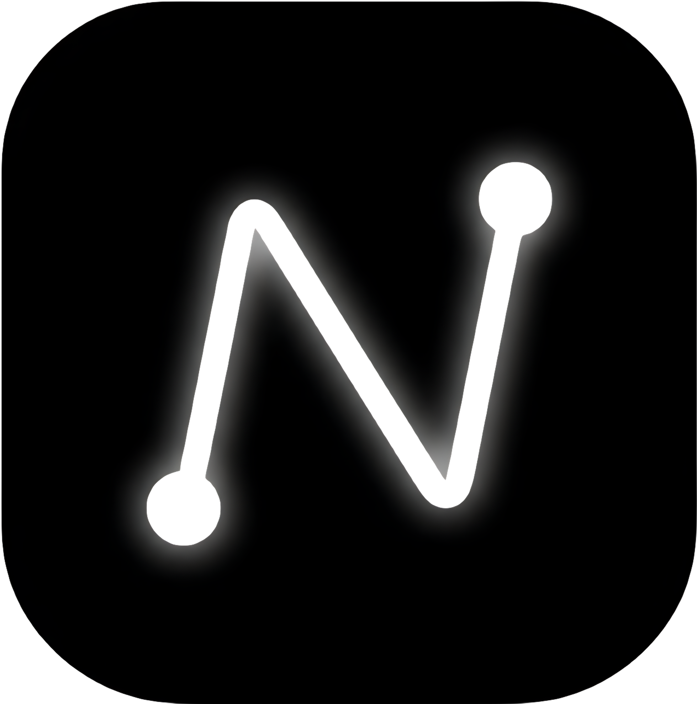

<div align="center">
   <div style="background-color: white; display: inline-block; padding: 10px; border-radius: 20px; box-shadow: 0 4px 6px rgba(0,0,0,0.1); margin-bottom: 20px;">
      
   </div>
   <h1 className="text-5xl">Link Number</h1>
   <p>A premium logic puzzle experience for the KOOMPI App ecosystem.</p>
</div>

# Link Number 
Link Number is a modern, interactive puzzle game built with React, TypeScript, and Framer Motion. It features a curated collection of handcrafted levels, a stunning "Liquid Glass" design system, seamless bilingual support, and dynamic scaling that ensures a perfect puzzle experience on any device.

---

## ✨ Core Features

-   **Bilingual Support**: Fully playable in both English and Khmer.
-   **Liquid Glass UI**: A premium, vibrant design system with smooth animations and glassmorphism.
-   **Handcrafted Levels**: 100+ curated levels ranging from simple grids to complex 9x9 challenges.
-   **Intelligent Path Drawing**: Smart interpolation allows smooth line drawing and auto-clearing of incomplete paths for better gameplay flow.
-   **Dynamic Grid Scaling**: Intelligent layout system that automatically adjusts padding, node size, and stroke widths for larger grid sizes.
-   **Persistent Progress**: Automatically saves your current level, drawn lines, and completed missions via local storage.
-   **Audio & Haptic Feedback**: Integrated sound effects and device vibration support for a tactile, responsive gameplay experience.
-   **PWA Ready & SEO Optimized**: Configured mobile web app metadata for "add to home screen" support and Open Graph integrations.

---

## 🚀 Quick Start

### Prerequisites

- **Node.js** (v16 or higher)
- **npm** or **yarn** package manager

### Local Development Setup

1. **Install dependencies:**

   ```bash
   npm install
   ```

2. **Configure environment variables:**
   - Copy `.env.example` to `.env.local`

3. **Start development server:**

   ```bash
   npm run dev
   ```

   The app will be available at `http://localhost:3000` (or the port defined by Vite).

---

## 📦 Available Scripts

| Command           | Purpose                                  |
| ----------------- | ---------------------------------------- |
| `npm run dev`     | Start development server with hot reload |
| `npm run build`   | Build for production                     |
| `npm run preview` | Preview production build locally         |

---

## 🛠️ Tech Stack

- **Frontend Framework:** React 18 with TypeScript
- **Animations:** motion/react (Framer Motion)
- **Icons:** lucide-react
- **Build Tool:** Vite
- **Package Manager:** npm

---

## 📁 Project Structure

```text
.
├── src/
│   ├── App.tsx           # Main application engine & game logic
│   ├── levels.ts         # Handcrafted puzzle configurations
│   ├── types.ts          # TypeScript interfaces
│   ├── themes.ts         # Unified color and "Liquid Glass" styles
│   └── main.tsx          # React DOM entry point
├── public/               # Static assets & Iconography
├── index.html            # HTML entry point (SEO & PWA configured)
├── vite.config.ts        # Vite configuration
├── tsconfig.json         # TypeScript configuration
├── package.json          # Project dependencies
└── README.md             # This documentation file
```

---

## 🤝 Contributing

1. Fork the repository
2. Create a feature branch: `git checkout -b feature/your-feature`
3. Commit changes: `git commit -m "feat: describe your changes"`
4. Push to branch: `git push origin feature/your-feature`
5. Open a Pull Request

---

## 📚 Resources

- [React](https://react.dev)
- [Vite](https://vitejs.dev)
- [TypeScript](https://www.typescriptlang.org/docs/)
- [Framer Motion](https://motion.dev/)
